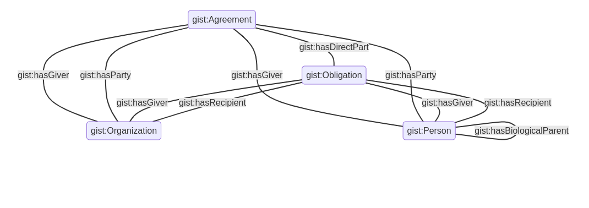

# rdfvis

This is a command line tool to take particular uris and print out a mermaid js
visualization in svg.


## Usage 

The `vis.py` library takes ontology files, and an argument for a specific owl
class, and returns a string formated for mermaid visualizations.

`vis.py -u <URI> <RDF.ttl>`


## How it works

This script takes the OWL restrictions in an ontology file and shows how a
specific class relates to the rest of the ontology. For example, the [gist
class](https://www.semanticarts.com/gist/) "Agreement" is defined like this:

```turtle
gist:Agreement
  a owl:Class ;
  rdfs:isDefinedBy <https://ontologies.semanticarts.com/o/gistCore> ;
    owl:equivalentClass [
      a owl:Class ;
      owl:intersectionOf (
        gist:Commitment
        [
          a owl:Restriction ;
          owl:onProperty gist:hasParty ;
          owl:someValuesFrom [
            a owl:Class ;
            owl:unionOf (
              gist:Organization
              gist:Person
            ) ;
          ] ;
        ]
        [
          a owl:Restriction ;
          owl:onProperty gist:hasDirectPart ;
          owl:onClass gist:Obligation ;
          owl:minQualifiedCardinality "2"^^xsd:nonNegativeInteger ;
        ]
      ) ;
    ] ;
  skos:definition "Something which two or more People or Organizations mutually commit to do."^^xsd:string ;
  skos:prefLabel "Agreement"^^xsd:string ; 
.

```

When run through the script, it returns a mermaid formated version like this: 

```
graph TB
      A(gist:Agreement) --gist:hasGiver--> B(gist:Organization)
      A --gist:hasGiver--> C(gist:Person)
      C --gist:hasBiologicalParent--> C
      A --gist:hasParty--> B
      A --gist:hasParty--> C
      A --gist:hasDirectPart--> D(gist:Obligation)
      D --gist:hasGiver--> B
      D --gist:hasGiver--> C
      D --gist:hasRecipient--> B
      D --gist:hasRecipient--> C
```

which produces the following diagram in mermaid: 


